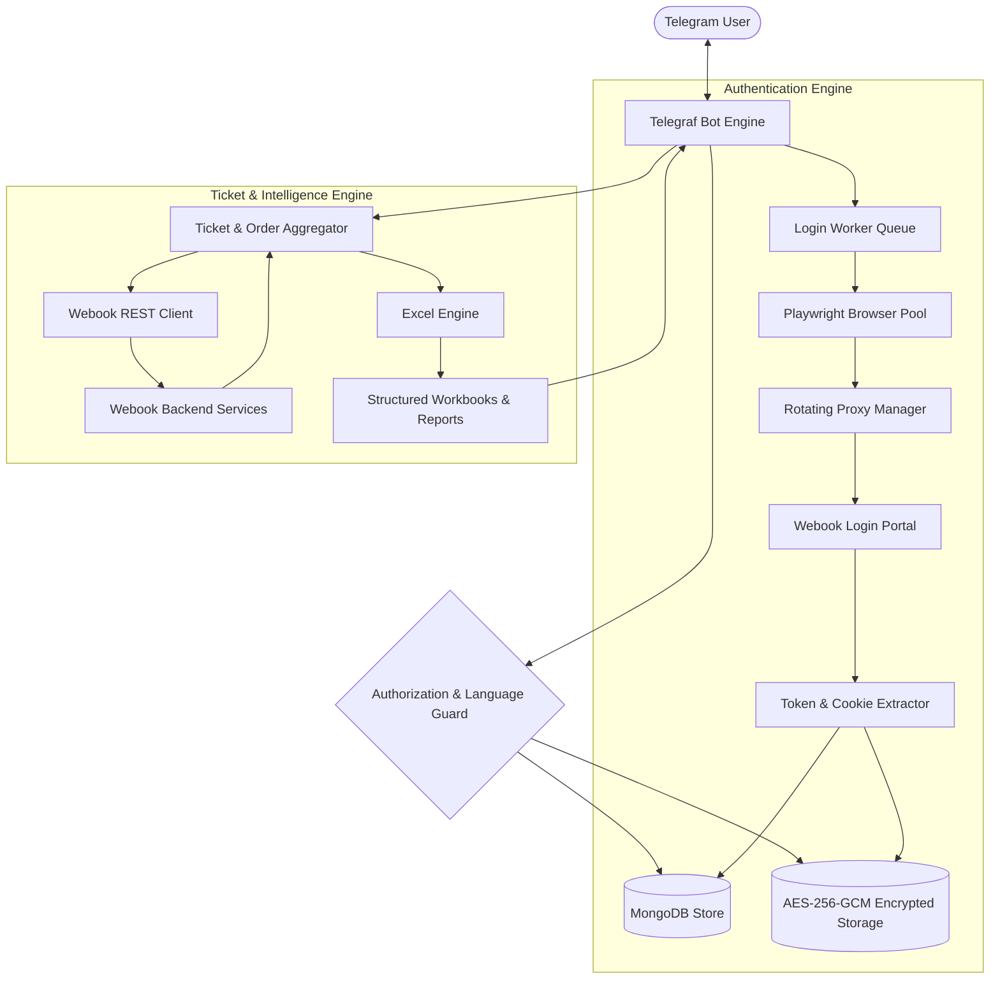

# Webook Automation & Session Orchestration Bot

A high-performance, enterprise-grade Telegram automation service built with Node.js, Playwright, MongoDB, and Telegraf. Designed for automated multi-account lifecycle management, background authentication queues, session encryption, real-time ticket aggregation, adjacent seat calculations, and multi-format Excel reporting.

---

## Architecture Overview



---

## Core Features

- **Queue-Based Headless Authentication:**
  - Parallel background worker pool orchestrating Playwright Chromium instances.
  - Automatic handling of cookie consents, form submissions, and token capture.
  - Anti-bot / Cloudflare challenge detection with non-blocking error handling.
  - Configurable worker concurrency, retry attempts, and batch processing limits.

- **Encrypted Session Persistence:**
  - AES-256-GCM encryption for all stored authentication states, cookies, and tokens.
  - Derived encryption keys using SHA-256 hashing over master keys.
  - Sensitive user passwords are used strictly in-flight and never persisted in plaintext.

- **Intelligent Proxy Management:**
  - Multi-protocol proxy rotation supporting HTTP, HTTPS, and SOCKS5.
  - Real-time proxy health tracking with automatic cooldown for unresponsive nodes.
  - Dynamic proxy synchronization from local files or remote subscription endpoints.

- **Automated Ticket & Order Aggregation:**
  - Fetches upcoming and past reservations directly from authenticated backend APIs.
  - Resolves detailed booking information including seat labels, row numbers, zones, and sections.
  - Real-time wallet balance queries and account health checks.

- **Comprehensive Excel Analytics:**
  - **General Report:** Comprehensive breakdown of all accounts, orders, and tickets.
  - **Adjacent Seats Analysis:** Identifies contiguous seats within identical rows and sections for group attendance.
  - **Scattered Seats Analysis:** Flags solitary or non-contiguous tickets.
  - **Per-Section Workbooks:** Automatically segments event tickets into dedicated workbooks separated by event date and venue section.

- **Multi-Tenant Administration:**
  - Telegram user role separation (Owner vs Authorized Operator).
  - Native bilingual interface (English and Arabic) with persistent per-chat language preferences.
  - Non-blocking administrative actions: batch linking, queue suspension, cancellation, and clean account removal.

---

## Technical Stack

| Component | Technology | Purpose |
| :--- | :--- | :--- |
| **Runtime** | Node.js (>= 18.x) | Core application execution environment |
| **Bot Framework** | Telegraf | Telegram Bot API integration and interaction |
| **Automation** | Playwright Chromium | Headless browser orchestration and session capture |
| **Database** | MongoDB & Mongoose | Account state, job queue status, and user privileges |
| **Cryptography** | Node.js `crypto` | AES-256-GCM authenticated session encryption |
| **Reporting** | SheetJS (`xlsx`) | Binary Excel workbook generation and seat modeling |
| **Networking** | Axios / HTTP(S) Agent | Direct high-throughput API communication |

---

## Prerequisites

Before deploying the bot, ensure the following software is installed on your host system:

1. **Node.js**: Version 18.0.0 or higher.
2. **MongoDB**: Local or hosted MongoDB instance (version 5.0+ recommended).
3. **Chromium Dependencies**: Standard Linux/Windows libraries required by Playwright.

---

## Quick Start

### 1. Repository Setup

```bash
cd webook-production
npm install
npx playwright install chromium
```

If deploying on a headless Linux host (e.g., Ubuntu/Debian), install browser dependencies:

```bash
npx playwright install-deps chromium
```

### 2. Environment Configuration

Copy the sample environment file and configure the necessary parameters:

```bash
cp .env.example .env
```

Open `.env` and fill in the required keys:

```dotenv
TELEGRAM_BOT_TOKEN=123456789:ABCdefGHIjklMNOpqrSTUvwxyz
BOT_OWNER_ID=987654321
MASTER_KEY=your_secure_random_key_minimum_32_characters_long
MONGODB_URI=mongodb://127.0.0.1:27017/webook_bot
```

### 3. Start the Bot

Run the production process:

```bash
npm start
```

To run syntax verification across all modules:

```bash
npm run check
```

---

## Configuration Reference

| Variable | Default | Description |
| :--- | :--- | :--- |
| `TELEGRAM_BOT_TOKEN` | *Required* | API token generated via `@BotFather`. |
| `BOT_OWNER_ID` | *Required* | Numeric Telegram ID of the administrator. |
| `MASTER_KEY` | *Required* | Secret passphrase (32+ chars) for AES-256-GCM encryption. |
| `MONGODB_URI` | `mongodb://127.0.0.1:27017/webook_bot` | Connection URI for the MongoDB server. |
| `MONGODB_POOL_SIZE` | `100` | Maximum socket pool connections. |
| `WEBBOOK_LOGIN_URL` | `https://webook.com/login` | Target login entry point. |
| `WEBBOOK_API_BASE` | `https://api.webook.com` | Base URL for REST API endpoints. |
| `WEBBOOK_API_TIMEOUT_MS` | `15000` | Timeout threshold for API calls. |
| `PLAYWRIGHT_HEADED` | `false` | Run browser with UI enabled (`true`) or headless (`false`). |
| `BLOCK_HEAVY_RESOURCES` | `true` | Aborts images, media, and stylesheets during login to save RAM/bandwidth. |
| `LINK_CONCURRENCY` | `2` | Concurrent bulk linking tasks per chat session. |
| `LOGIN_QUEUE_CONCURRENCY` | `10` | Maximum concurrent background login workers globally. |
| `LOGIN_QUEUE_BATCH_SIZE` | `10` | Number of accounts processed per queue batch. |
| `LOGIN_RESULT_TIMEOUT_MS` | `25000` | Playwright navigation and submit timeout. |
| `TICKET_FETCH_CONCURRENCY`| `12` | Concurrency for fetching tickets across stored accounts. |
| `EVENT_CHECK_CONCURRENCY` | `20` | Parallel checks for event eligibility. |
| `PROXY_FILE` | `data/proxies.txt` | Path to local proxy file (one proxy per line). |
| `PROXY_LIST_URL` | *Optional* | Endpoint returning dynamic proxy lists. |
| `PROXY_COOLDOWN_MS` | `300000` | Duration (ms) a failed proxy is quarantined (5 minutes). |

---

## Bot Interaction & Usage

### Core Commands

- `/start` — Initializes the interactive menu and language selection (Arabic / English).
- `/linklist` — Initiates multi-account batch linking.
- `/tickets` — Triggers synchronous ticket extraction across all saved accounts and produces Excel downloads.
- `/status` — Displays current session states, valid accounts, expired sessions, and worker status.
- `/stop` — Gracefully halts active login queues and pending worker jobs.
- `/deleteaccounts` — Interactive prompt to selectively or completely remove linked accounts and cached sessions.
- `/adduser <id>` — *(Owner only)* Authorizes a Telegram user ID to operate the bot.
- `/users` — *(Owner only)* Lists currently authorized operators.

### Bulk Account Linking Format

Send `/linklist` followed by account credentials (one account per line). Multiple messages are grouped automatically:

```text
user1@domain.com,Password123
user2@domain.com,Password456
user3@domain.com,Password789
```

---

## Production Deployment

### Option A: Process Management with PM2

Install PM2 globally:

```bash
npm install -g pm2
```

Launch the service with automatic restarts and log rotation:

```bash
pm2 start src/index.js --name "webook-bot" --max-memory-restart 1G
pm2 save
pm2 startup
```

Monitor logs:

```bash
pm2 logs webook-bot
```

### Option B: Systemd Service (Linux)

Create `/etc/systemd/system/webook-bot.service`:

```ini
[Unit]
Description=Webook Telegram Bot Production Service
After=network.target mongod.service

[Service]
Type=simple
User=ubuntu
WorkingDirectory=/path/to/webook-production
ExecStart=/usr/bin/node src/index.js
Restart=always
RestartSec=10
Environment=NODE_ENV=production

[Install]
WantedBy=multi-user.target
```

Reload and enable the service:

```bash
sudo systemctl daemon-reload
sudo systemctl enable webook-bot
sudo systemctl start webook-bot
```

---

## Security Practices

1. **Key Separation:** Never commit your `.env` file or encryption keys to version control.
2. **Database Hardening:** Restrict MongoDB access using strong authentication and network binding (`127.0.0.1` or dedicated VPC).
3. **Proxy Sanitation:** Rotate IP addresses when managing high volumes of accounts to prevent temporary network blocks.
4. **Session Hygiene:** Encrypted sessions expire according to Webook token lifecycles; regular re-linking through `/linklist` refreshes expired authentication tokens seamlessly.

---

## License

This project is private and proprietary. Unauthorized copying, distribution, or deployment is strictly prohibited.
